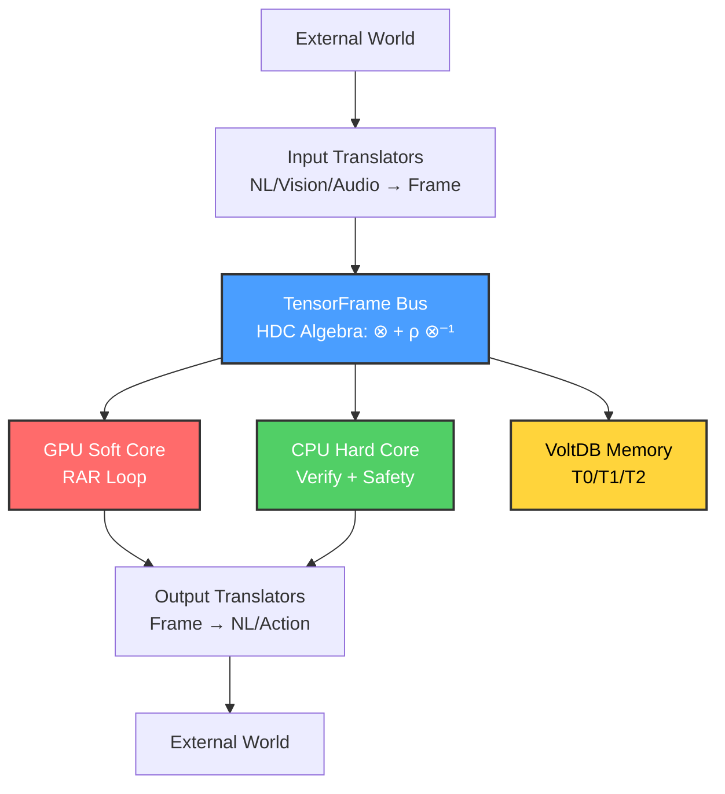
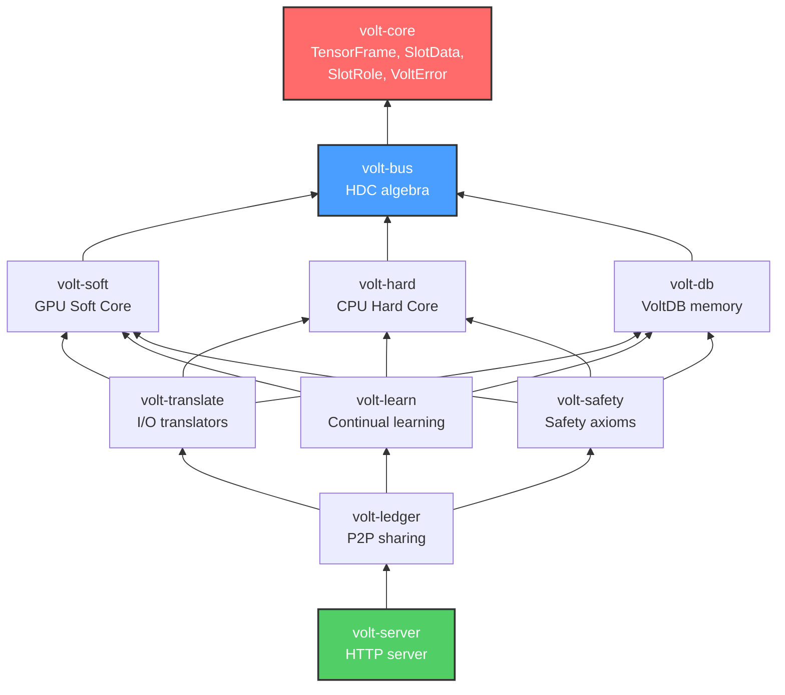

# Volt X

A cognitive architecture built in Rust that replaces the transformer inference loop with structured tensor frames, split-brain GPU/CPU processing, and three-tier persistent memory.

## What This Is

Volt X is a stateful AI system where the unit of computation is a **TensorFrame** — a sparse 3D tensor `[16 slots × 4 resolutions × 256 dims]` — instead of a flat token sequence. Inference happens through an iterative **Root-Attend-Refine (RAR)** loop where slots converge independently, rather than a single forward pass through a transformer.

The system splits processing between a GPU "Soft Core" (neural intuition via stochastic differential equations) and a CPU "Hard Core" (deterministic logic, exact math, safety verification). Memory persists across conversations in a three-tier store (working → strand → archive) instead of being bounded by a context window.

## Architecture



### TensorFrame `[S=16 × R=4 × D=256]`

Each frame holds up to 16 **slots** (semantic roles: Agent, Predicate, Patient, Location, Time, Manner, Instrument, Cause, Result, + 7 free), each with up to 4 **resolution levels** (discourse → proposition → phrase → token), each a 256-dim embedding vector. Frames are sparse — a typical thought uses ~4 slots at ~2 resolutions (8KB), max is 64KB.

Every slot carries an independent certainty score (γ ∈ [0,1]). The frame-level certainty is `min(slot γ values)` — the system is only as confident as its weakest component.

### Root-Attend-Refine (RAR) Inference

Instead of a single forward pass, inference iterates:

1. **Root** — Each slot runs an independent forward pass through a shared Vector Field Network. Embarrassingly parallel on GPU. Converged slots skip.
2. **Attend** — Cross-slot attention O(S²×D) = O(16²×256) ≈ 65K multiply-adds. Ghost frames from long-term memory also attend here.
3. **Refine** — State update, manifold projection, per-slot convergence check. Converged slots freeze.

The loop repeats until all slots converge or a compute budget is hit. Simple queries take ~2 iterations (~15ms), reasoning takes ~8-15 iterations (~100-200ms).

### Split-Brain Processing

| | GPU Soft Core | CPU Hard Core |
|---|---|---|
| **Role** | Neural intuition | Deterministic logic |
| **Mechanism** | SDE: `dF = −∇E(F,t)dt + σdW` | Rust branching + HDC algebra |
| **Math** | Approximate (learned attractors) | Exact (computed, not predicted) |
| **Safety** | None (generates candidates) | Axiomatic guard + Omega Veto |
| **Parallelism** | SIMD slot-parallel | Tokio + Rayon task-parallel |

### VoltDB Three-Tier Memory

| Tier | Location | Capacity | Access Time | Purpose |
|---|---|---|---|---|
| T0 | VRAM/RAM | 64 frames | Instant | Working memory |
| T1 | RAM | Millions | ~500μs (HNSW) | Strand-organized long-term |
| T2 | Disk | Unlimited | ~5ms | Compressed archive |

Frames evict T0 → T1 → T2. Ghost frames (R₀ gists from T1/T2) bias the GPU energy landscape without loading full frames.

### Training

Uses Hinton's Forward-Forward algorithm instead of backpropagation. Only one layer is in VRAM at a time, so training VRAM ≈ inference VRAM. An RTX 4060 (8GB) is sufficient. Tradeoff: ~3× slower than backprop, ~24× less VRAM.

## Workspace

10 Rust crates with enforced dependency direction:



## Building

Requires Rust edition 2024 (nightly or stable 1.85+).

```bash
cargo check --workspace        # type check
cargo test --workspace         # run all tests
cargo clippy --workspace -- -D warnings  # lint
cargo bench --workspace        # benchmarks
```

Or use the aliases in `.cargo/config.toml`:

```bash
cargo t   # test
cargo c   # clippy
cargo b   # bench
```

## Current Status

`volt-core` is fully implemented with TensorFrame, slot management, certainty propagation, and complete test coverage (35 tests including doc tests). All other crates have their dependency wiring and architecture stubs in place. See the milestone TODOs in each crate's `lib.rs` for what's next.

## Design References

- ARCHITECTURE.md — full technical specification
- DECISIONS.md — architecture decision records with rationale
- SVGs.md — visual architecture diagrams
- CLAUDE.md — instructions for AI-assisted development
